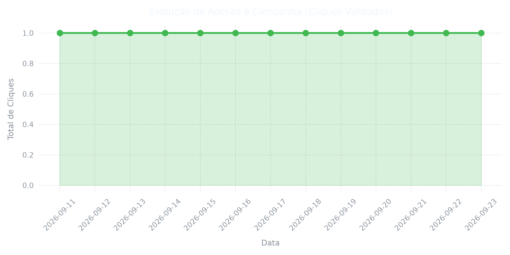

# Green Computing Edu: Sobriedade Digital na Educação
### Artefato Central: Mini-Guia de Eficiência Energética Móvel

[](https://brasil.un.org/pt-br/sdgs/4)
[](https://brasil.un.org/pt-br/sdgs/6)
[](https://brasil.un.org/pt-br/sdgs/7)
[](https://www.gov.br/mec/pt-br)
[](LICENSE)
[](https://github.com/naygno/green-computing-edu/actions)

<p align="center">
  <a href="https://github.com/naygno/green-computing-edu/releases/latest">
    
  </a>
</p>

<p align="center">
   
</p>

## 📌 Sobre o Projeto
O **Green Computing Edu** é um projeto multidisciplinar desenvolvido na graduação em Ciência da Computação (UFBRA). A iniciativa capacita educadores e a comunidade escolar na aplicação prática de Lean ICT (TI Enxuta) e Sobriedade Digital, mitigando a pegada ecológica e energética gerada pelo ecossistema de dispositivos móveis.

A ação atua como recurso didático complementar alinhado aos **Temas Contemporâneos Transversais da BNCC** (*Meio Ambiente* e *Ciência e Tecnologia*), fornecendo tutoriais objetivos para estancar o consumo desnecessário de dados e prolongar a vida útil de smartphones.

---

## 🔬 Fundamentação Epistêmica e Problema de Engenharia

O avanço tecnológico desregulado gerou gargalos críticos abordados por este projeto:

1. **A Crise do Lixo Eletrônico (*E-waste*) e a Lei de Wirth:**
   Segundo o *Global E-waste Monitor 2024* (ONU/ITU), o planeta atingiu a marca de **62 milhões de toneladas de lixo eletrônico por ano**, crescendo 5 vezes mais rápido que a reciclagem formal. O descarte precoce de celulares é acelerado pela incapacidade do hardware legado de processar softwares inchados e sem otimização (*Software Bloat* / Lei de Wirth).
2. **O Consumo Invisível de Rede e a Métrica WUE:**
   Conforme documentado pelo *The Shift Project* (*Lean ICT: Towards Digital Sobriety*, 2019), o consumo elétrico do setor digital cresce cerca de **9% ao ano**. O processamento massivo em nuvem e a transferência ininterrupta de pacotes exigem resfriamento constante em Data Centers, agravando o consumo de água potável medido pelo índice **WUE (*Water Usage Effectiveness*)**, padronizado pelo consórcio *The Green Grid*.
3. **O Custo do Código de Terceiros e o Dreno de Fundo (*Tail Energy*):**
   Pesquisas canônicas de engenharia móvel (Pathak et al., *ACM EuroSys 2012*) comprovam que **até 75% da energia** em aplicações gratuitas é consumida por módulos de telemetria e anúncios de terceiros. Esse tráfego constante mantém os rádios de comunicação (modems 4G/5G) em estados contínuos de alta potência (fenômeno conhecido como *Tail State*), provocando estresse térmico no processador e degradação prematura das baterias de lítio.

---

> 📊 **Telemetria de Impacto:** <!-- CLICKS_START -->**1**<!-- CLICKS_END --> adesão(ões) confirmada(s) via Cutt.ly  
> ⏱️ *Última sincronização:* <!-- DATE_START -->(Atualizado em 23/09/2026 às 01:11)<!-- DATE_END -->

## 📈 Histórico de Conversão e Impacto
Os dados abaixo são atualizados de forma totalmente automatizada via pipeline de CI/CD (**GitHub Actions + Python + Cutt.ly Regular API**). A telemetria monitora o alcance do material educativo coletando apenas métricas agregadas de alcance e conversão, sem expor dados pessoais dos usuários.

<p align="center">
   
</p>

---

## 🚀 Artefatos do Projeto

1. **Guia de Sobriedade Digital para Educadores (PDF 9:16):**
   - Distribuído via [GitHub Releases](https://github.com/naygno/green-computing-edu/releases/latest) (versão mais recente sempre no link `guia_sobriedade_edu.pdf`).
   - Material diagramado em LaTeX nativo (formato mobile *viewport* 9:16).
   - Abordagem em 4 etapas: Ativação de DNS Privado (bloqueio de anúncios na raiz), Restrição de Dados em 2º Plano, Desativação de Reprodução Automática de Mídia e Preservação de Ciclos de Carga.
2. **Pipeline de Extração de Dados e Telemetria:**
   - Integração com a API do **Cutt.ly** através de script em Python (`fetch_telemetry.py`).
   - Processamento de séries temporais com `pandas`, geração de gráficos analíticos em `matplotlib` e reescrita dinâmica do README via GitHub Actions.
3. **Instrumento de Avaliação de Usabilidade (UX):**
   - *Status: formulário pendente de publicação.* O instrumento será estruturado para mensurar clareza didática, facilidade de configuração e percepção empírica de melhora térmica e de autonomia de bateria nos aparelhos.

---

## 📁 Estrutura de Diretórios

```text
green-computing-edu/
├── .github/
│   └── workflows/
│       └── telemetry.yml        # Automação periódica de dados (CI/CD)
├── assets/
│   ├── capa_guia_9_16.png       # Imagem vetorial vertical para a capa do PDF
│   ├── cerrado_urbano.png       # Banner horizontal (estética 3D Low-Poly)
│   ├── ok_registrado.png        # Endpoint de confirmação do clique
│   ├── telemetry_chart.png      # Gráfico analítico dinâmico (gerado pelo CI)
│   ├── telemetry_history.csv    # Série histórica de telemetria
│   └── screenshots/             # Capturas de tela dos tutoriais de configuração
├── scripts/
│   └── fetch_telemetry.py       # Script de integração com Cutt.ly Regular API
├── src/
│   └── latex/
│       └── main.tex             # Código-fonte tipográfico do guia
├── .gitignore
├── LICENSE
└── README.md
```

## 🛠️ Tecnologias e Ferramentas

* **Engenharia de Dados e Automação:** Python 3.11, Pandas, Matplotlib, GitHub Actions, Cutt.ly Regular API.
* **Tipografia e Documentação:** LaTeX (`pdflatex`), pacotes `geometry`, `tcolorbox`, `microtype`, `roboto`.
* **Design Gráfico:** DALL-E 3 (estética 3D Low-Poly do Cerrado urbano), Inkscape, GIMP.
* **Referenciais Normativos:** NBR 14724 (ABNT), BNCC / MEC (Temas Contemporâneos Transversais).

---

## 💻 Compilação Local do Documento

Para compilar a cartilha a partir do código-fonte TeX (requer TeX Live ou MiKTeX instalado):

```bash
cd src/latex
pdflatex -interaction=nonstopmode main.tex
```

---

## 📚 Referências

1. Forti, V., Baldé, C.P., Kuehr, R., & Ang, G. (2024). *The Global E-Waste Monitor 2024*. UNITAR/ITU.
2. The Shift Project. (2019). *Lean ICT: Towards Digital Sobriety*.
3. Pathak, A., Hu, Y.C., & Zhang, M. (2012). *Where is the energy spent inside my app? Fine Grained Energy Accounting on Smartphones with Eprof*. ACM EuroSys.
4. The Green Grid. *Water Usage Effectiveness (WUE): A Metric for Data Center Sustainability*.

---

**Autor:** @naygno — *Acadêmico de Ciência da Computação (UFBRA)*